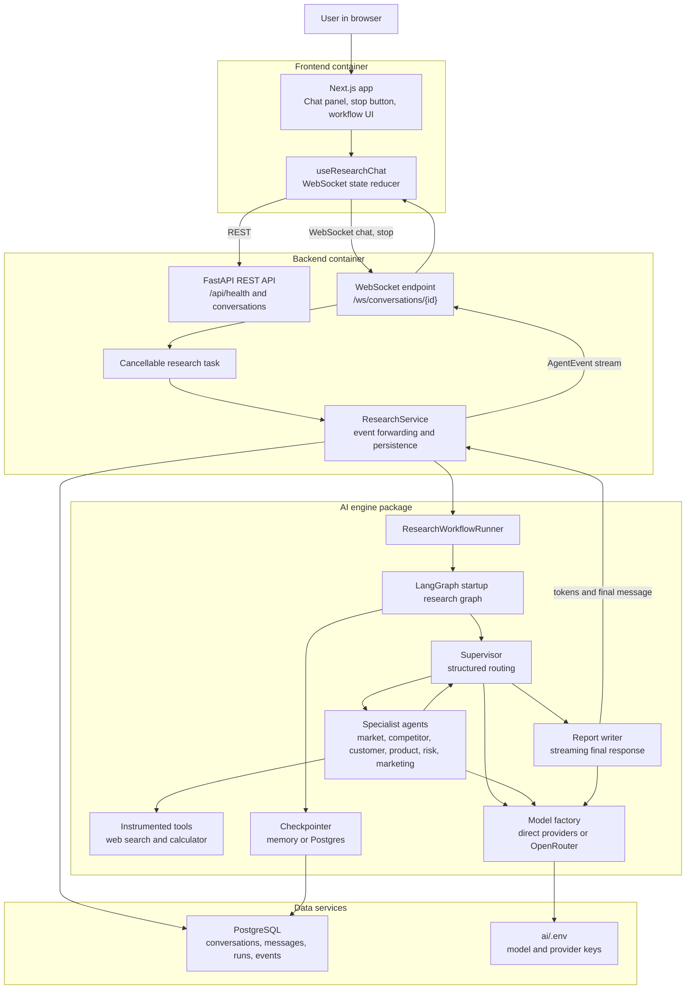

# Architecture

```mermaid
flowchart TB
    User["User in browser"]

    subgraph Frontend["Frontend container"]
        UI["Next.js app<br/>Chat panel, stop button, workflow UI"]
        Hook["useResearchChat<br/>WebSocket state reducer"]
    end

    subgraph Backend["Backend container"]
        API["FastAPI REST API<br/>/api/health and conversations"]
        WS["WebSocket endpoint<br/>/ws/conversations/{id}"]
        Task["Cancellable research task"]
        Service["ResearchService<br/>event forwarding and persistence"]
    end

    subgraph AI["AI engine package"]
        Runner["ResearchWorkflowRunner"]
        Graph["LangGraph startup research graph"]
        Supervisor["Supervisor<br/>structured routing"]
        Specialists["Specialist agents<br/>market, competitor, customer, product, risk, marketing"]
        Writer["Report writer<br/>streaming final response"]
        Tools["Instrumented tools<br/>web search and calculator"]
        Models["Model factory<br/>direct providers or OpenRouter"]
        Memory["Checkpointer<br/>memory or Postgres"]
    end

    subgraph Data["Data services"]
        Postgres["PostgreSQL<br/>conversations, messages, runs, events"]
        Env["ai/.env<br/>model and provider keys"]
    end

    User --> UI
    UI --> Hook
    Hook -->|"REST"| API
    Hook -->|"WebSocket chat, stop"| WS
    WS --> Task
    Task --> Service
    Service --> Runner
    Runner --> Graph
    Graph --> Supervisor
    Supervisor --> Specialists
    Specialists --> Tools
    Specialists --> Supervisor
    Supervisor --> Writer
    Writer -->|"tokens and final message"| Service
    Service -->|"AgentEvent stream"| WS
    WS --> Hook
    Service --> Postgres
    Memory --> Postgres
    Graph --> Memory
    Supervisor --> Models
    Specialists --> Models
    Writer --> Models
    Models --> Env
```
