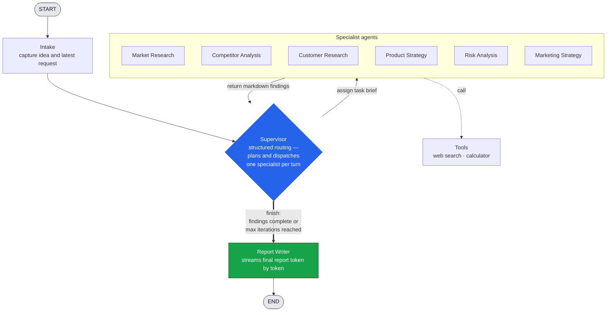

# Startup Agent Lab

A supervisor-led, multi-agent research workflow built on **LangChain 1.x** and
**LangGraph 1.x**. A single supervisor plans the work, dispatches specialist
agents one at a time, reviews what each returns, and hands off to a report
writer that streams the final answer.

> Setup, configuration, and how-to-run details live in **[INSTRUCTIONS.md](INSTRUCTIONS.md)**.
> The full system (frontend, backend, data) diagram lives in **[ARCHITECTURE.md](ARCHITECTURE.md)**.

## Agent Orchestration

## How the loop works

1. **Intake** records the business idea and the user's latest request, then emits
   the agent roster to the UI.
2. The **Supervisor** uses structured output (`RouteDecision`) to pick the next
   specialist and write a concrete task brief — or to `finish`. The allowed
   choices are baked in as a `Literal`, so it structurally cannot route to a
   nonexistent agent.
3. The chosen **specialist** runs with the shared findings as context, optionally
   calls **tools** (web search, calculator), and returns markdown findings — then
   control loops back to the supervisor.
4. Steps 2–3 repeat until the supervisor decides the findings are complete, or the
   run hits `max_iterations` (default `10`).
5. The **Report Writer** synthesizes every finding into the final report and
   streams it token by token to the client.

Each node communicates progress only through `AgentEvent`s on LangGraph's
`custom` stream; the backend and frontend never inspect raw graph state.

## Agent Team

| Agent | Role |
|---|---|
| Supervisor | Plans work, assigns specialists, reviews findings, decides when to finish |
| Market Research | Market size, demand, trends, and timing |
| Competitor Analysis | Direct and indirect competitors, strengths, gaps |
| Customer Research | Segments, personas, pain points, willingness to pay |
| Product Strategy | Value proposition, MVP, pricing, business model |
| Risk Analysis | Market, execution, financial, legal, and technical risks |
| Marketing Strategy | Positioning, launch plan, channels, growth loops |
| Report Writer | Synthesizes findings into the final answer |

The roster is data-driven: wiring lives in
[`ai/src/ai_core/prompts/workflows/startup_research.yaml`](ai/src/ai_core/prompts/workflows/startup_research.yaml),
and each agent has a matching prompt file under `ai/src/ai_core/prompts/agents/`.
